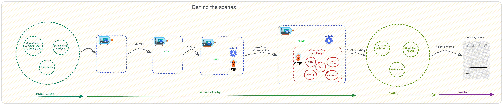

# Welcome to Initium platform

Please take a second learn about [initium-platform code repo](https://github.com/nearform/initium-platform/blob/main/README.md).

We greatly appreciate bug fixes, documentation improvements and new features, however when contributing a new major feature, it is a good idea to idea to first open an issue, to make sure the feature it fits with the goal of the project, so we don't waste your or our time.

## General mechanics



## How To Contribute

<a id="contributing-how-to"></a>

If you'd like to contribute, start by searching through the
[issues](https://github.com/nearform/initium-platform/issues) and [pull
requests](https://github.com/nearform/initium-platform/pulls) to see whether someone else
has raised a similar idea or question.

If you don't see your idea listed, and you think it fits into the goals of this
guide, do one of the following:

* **If your contribution is minor,** such as a typo fix, open a pull request.
* **If your contribution is major,** such as a new feature, start by opening an
  issue first. That way, other people can weigh in on the discussion before you
  do any work.

## Conventional Commits

We use [Conventional Commits](https://www.conventionalcommits.org/en/v1.0.0/) in this repo. We encourage contributors to name their PRs and commits accordingly. That is required for keeping the repo clean, and [release-please](https://github.com/googleapis/release-please) to do its job when automating release creation.

Basically, the `fix` and `feat` words on commits will trigger new releases (with `fix` being patch versions and `feat` minor versions, unless there is an exclamation mark (`!`) after one of both, which will trigger a major version release). Other keywords won't trigger releases, but they are welcome in order to better readability of the changes made. Examples: `docs`, `chore`, `ci`, `test` and so on.

## Bug Reports

A perfect bug report would have the following:

1. Summary of the issue you are experiencing.
2. A simple repeatable test case for us to run. Please try to run through it 2-3 times to ensure it is completely repeatable.

We would like to avoid issues that require a follow up questions to identify the bug. These follow ups are difficult to do unless we have a repeatable test case.

## How to create a new release

> **PLEASE NOTE:** In order to make sure this release pipeline works, every PR and commit MUST use the [Conventional Commits](https://www.conventionalcommits.org/) syntax.

This project uses an automated release setup that is based on [release-please](https://github.com/googleapis/release-please). For a more detailed overview on how it works, feel free to read [their official introduction](https://github.com/googleapis/release-please#whats-a-release-pr).

In short, what happens is that during the normal lifecycle of contributions, as you keep merging PRs, a new release PR will be made (or updated) which will list the changes that will be included in such release ( for eg. see https://github.com/nearform/initium-platform/pull/11 ).

Once you merge the PR, a new release will be made and the [`CHANGELOG.md`](https://github.com/nearform/initium-platform/blob/main/CHANGELOG.md) will be updated as well. As soon as the release is created, [this workflow](https://github.com/nearform/initium-platform/blob/main/.github/workflows/assets.yaml) will be run on top of it, and as a result it will upload on such release the final assets that we deliver for the end-user.

These assets can finally be found on the release Assets section ( for eg. see https://github.com/nearform/initium-platform/releases/tag/v0.0.1 ).

## Running the local stack

Since this project is mostly based on the concept of [ArgoCD app of apps](https://argo-cd.readthedocs.io/en/stable/operator-manual/cluster-bootstrapping/#app-of-apps-pattern) it will require a Git repository to host the components required to be deployed by ArgoCD on the cluster.

Usually you would see your ArgoCD Applications pointing to a Github repository or any other Git repository that is available to your network. On our own side we bypass this by providing your local repository ( the one you use once you clone this repository in your own workstation ) as a "remote repository" to the eyes of ArgoCD when you deploy the stack locally.

How this is done is simple:
- We use a project named [git-http-backend](https://github.com/ynohat/git-http-backend) where you basically mirror your local folder as an HTTP Git server
- We mount the **parent folder** of where you clone this repository [in kind](./manifests/kind/templates/cluster.yaml#L6-9) so later on the charts can use the `containerPath` as mount volume
- We build a docker image of this project locally to ensure it doesn't change in time and no malicious code comes with it, see [utils/git-http-backend/docker](utils/git-http-backend/docker)
- We create a custom Helm chart to deploy the built container, see [utils/git-http-backend/chart](utils/git-http-backend/chart)
- We [build and deploy the image as a chart in the cluster via Tilt](./Tiltfile#L12-18) and we pass to the container image the [kind mounted path](./manifests/kind/templates/cluster.yaml#L8) of where this repository lives, so you can later access it via the [INITIUM_REPO_URI defined in the .envrc](./.envrc#L8) ( eg. `http://git-http-backend/git/initium-platform` )

**REMEMBER:** As ArgoCD will use the latest commit to checkout changes, you **will have** to commit your changes locally otherwise ArgoCD won't be able to see them. Pushing is **NOT REQUIRED**.

This change will allow you to test the entire solution without requiring a special access to the central Git server repository. All you will need is just your workstation and an internet connection.

## Renovate Bot

This project makes use of the [Renovate Bot](https://docs.renovatebot.com/) to automatically bump chart versions.

### Bump your addons using a single PR

There are some edge cases to be considered when your addon is divided in multiple charts ( for example, see the [istio addon](https://github.com/nearform/initium-platform/tree/main/addons/istio) ). In such cases, Renovate Bot will by default open a PR for each chart detected to be bumped, although this would make the PR difficult to be merged, as each part of the Istio stack has to be bumped as a whole to work correctly.

In order to fix this behavior, you will need to add into the [packageRules](https://github.com/nearform/initium-platform/blob/main/.github/renovate.json5#L11) section an object that will instruct the Renovate bot to consider the addon as whole. Following the istio example, this is the configuration to be used:
```js
{
  matchPaths: ["addons/istio/**"],
  groupName: "Istio Helm Chart"
}
```

You can find out more about this syntax on the relative documentation page at this address: https://docs.renovatebot.com/configuration-options/#packagerules

## FAQ

Q: Why does this repo create a Tilt local_resource for Istio ingress since there is already a MetalLB instance setting an Load Balancer IP address for it?

A: As per [the Kind docs](https://kind.sigs.k8s.io/docs/user/loadbalancer/):

> On MacOS and Windows, docker does not expose the docker network to the host. Because of this limitation, containers (including kind nodes) are only reachable from the host via port-forwards, however other containers/pods can reach other things running in docker including loadbalancers.

The Tilt local_resource for port-forwarding the Istio ingress ports is a workaround for that limitation.
