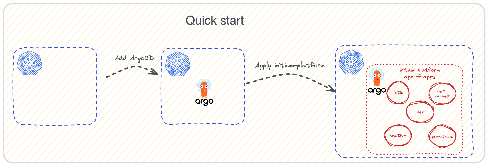

# initium-platform

This repository is a tentative approach to offer a set of add-ons that will provide a day-0 platform ready to be used in a matter of hours instead of weeks.

To accomplish that, it uses the ArgoCD [app of apps concept](https://argo-cd.readthedocs.io/en/stable/operator-manual/cluster-bootstrapping/#app-of-apps-pattern).

Therefore, ArgoCD is the main requirement to run this project on your cluster.

> **PLEASE NOTE:** This project is currently WIP and NOT stable. Use at your own risk!

## Install on your own cluster


> **HINT** This project uses `tilt` to bring up environment, but there are 2 executables named `tilt`. If you already have it on your system, make sure that you are using [tilt.dev](https://tilt.dev/) instead of [Ruby tilt](https://github.com/rtomayko/tilt)




If you dont have `argocd` on your cluster, the following command will install it with required configuration. Make sure that you are using the correct Kubernetes context before run.

```bash
$ make argocd
```

If you already have `argocd` (if installed with helm, the name of the chart should be argocd) deployed in your cluster to make deployment successful and all addons synced it is required to verify if following configuration is part of your ArgoCD configuration: [argocd/values.yaml](https://github.com/nearform/initium-platform/blob/main/addons/argocd/values.yaml#L23).
You can check it by describing argo-cd config map:

```
kubectl describe cm argocd-cm -n argocd
```

Don't apply changes directly to the Config Map, but apply them the in your installation scripts/helm chart values.

Next, you can download the provided `app-of-apps.yaml` in our [latest stable release](https://github.com/nearform/initium-platform/releases/latest) and then apply that manifest using this command:

```bash
kubectl apply -f app-of-apps.yaml
```

Full list of the addons that the manifest is installing and additional information for each of them can be found in the [docs/ADDONS.md](docs/ADDONS.md) file.

### Pass your own values to the addons

You can pass your own values or override default values to the addons by modifying the `app-of-apps.yaml` manifest, you can get more details here [docs/ADDONS.md](docs/ADDONS.md#override-values)

### Supported Setups

Below there is a matrix with the cloud providers & Kubernetes versions our setup has been tested with. 

| Cloud Provider   | Kubernetes Version |
|------------------|:------------------:|
| AWS              | 1.27               | 
| GCP              | 1.27               |
| Azure            | 1.27               |


## Run locally

### Pre-requisites

You need Docker installed (or similar solutions) to run this project.

Here you can find a list of possible candidates:

- [Docker](https://docs.docker.com/engine/install/) ( cross-platform, paid solution )
- [Rancher Desktop](https://rancherdesktop.io/) ( cross-platform, FOSS )
- [lima](https://github.com/lima-vm/lima) + [nerdctl](https://github.com/containerd/nerdctl) ( macOS only )

Remember that to run this solution you also need at least:

- 4 CPU cores
- 8 GB RAM - Maybe is necessary to increase Docker limits to use more RAM or Swap to run all components with 8GB RAM.
- 16 GB Disk space

Those numbers are not written in stone so your mileage may vary depending on which components you choose to install.

> **HINT:** To run everything on Windows machine is recommended to use [WSL](https://learn.microsoft.com/en-us/windows/wsl/install) and install Docker inside this subsystem.

### Bootstrap

> **HINT:** If you want to remove the automatically installed dependencies via asdf once you're done with this project, you can run `make asdf_uninstall`.

To continue with the deployment, you need a set of tools installed first. You can either install them manually (see [.tool-versions](.tool-versions) ), or you can install them automatically by following these steps:

1. Install [`asdf-vm`](https://asdf-vm.com/)
2. Run the following command: `make asdf_install`

### Deploy

> **HINT:** If you want to know which commands are available you can always run `make help` on this project.

#### CLI


Make sure you've followed the [bootstrap steps](#bootstrap), then:

```bash
$ make ci
```

Once completed, you're ready to interact with the cluster using `kubectl` as usual.

The current Kubernetes version that will run locally in the project is defined in the `.envrc` file, using the variable `K8S_VERSION`. If you want to run a different local k8s version, please change this value.

Github runners are using a matrix strategy to run unit and integration tests on three different k8s versions.
Take a look at the `.github/workflows/integration.yaml` or `.github/workflows/preview.yaml` for an example.

#### GUI

Make sure you've followed the [bootstrap steps](#bootstrap), then:

1. Deploy the local environment:

   ```bash
   # Deploy the cluster and run tilt visually
   $ make
   ```

   You can access the Kind K8s cluster using any kubernetes client like kubectl or Lens.<br>
   [Accessing Argocd UI](https://argo-cd.readthedocs.io/en/stable/getting_started/#3-access-the-argo-cd-api-server)

2. (Optional) Run the two following resources in tilt to portforward argocd and get the default admin password

   ```
   - argocd-portforward
   - argocd-password
   ```

   > **PLEASE NOTE:** The port forwarding sometimes seems to drop, so re-run the tilt resource to get the connection up and running again.

3. (Optional) Test app-of-apps values changes using the override feature of the bootstrap app, following the instructions in the `./manifests/bootstrap/overrides.local.yaml.tmpl` file.

#### Cleanup

> **IMPORTANT:** Make sure to run this command while tilt is NOT running.

In order to cleanup the solution from your own local environment you can run:

```bash
$ make clean
```

### Tests

#### Unit tests

All the tests are inside the `tests` folder. This folder contains tests written in golang to check if the charts
configurations are valid. To create the tests, we use [terratest](https://terratest.gruntwork.io/).
Terratest provides a variety of [helper functions](https://github.com/gruntwork-io/terratest) created by Gruntwork,
To make the infrastructure test setup easier.

Before running tests make sure you've followed the [bootstrap steps](#bootstrap).

Once ready, you can use this simple set of commands:

```bash
# Create the cluster
$ INITIUM_DEPLOY_MINIMAL=true make ci
# Run the unit tests
$ make unit-test
```

#### Integration tests

As unit tests, we also use [terratest](https://terratest.gruntwork.io/). The main difference is that each test is encapsulated by its goal.
See the [examples/sample-app](examples/sample-app) as an example.

Before running tests make sure you've followed the [bootstrap steps](#bootstrap).

Once ready, you can use this simple set of commands:

```bash
# Create the cluster and all the required dependencies
$ make ci
# Run the unit tests
$ make integration-test
```

## Contribute

If you desire to contribute to this project, please make sure you have read the [CONTRIBUTING.md](CONTRIBUTING.md) file first.

Once you feel ready for it, remember to [fork this repository](https://github.com/nearform/initium-platform/fork).

Clone your fork into your own local workstation, then finally run the following command to install the project dependencies using [asdf-vm](https://asdf-vm.com/) and [precommit](https://pre-commit.com/) hooks:

```bash
cd path/to/initium-platform
make bootstrap
```

You're now ready to contribute!

## CI Process

After deploying the cluster, you may wish to integrate it with a CI tool of choice.
For more information on this subject, consult [CI Service Account Readme](manifests/ci-service-account/README.md)
